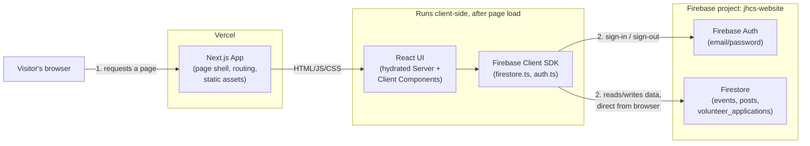
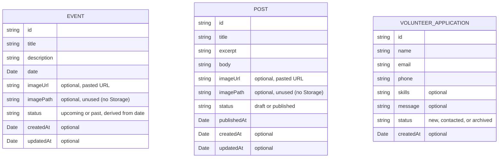
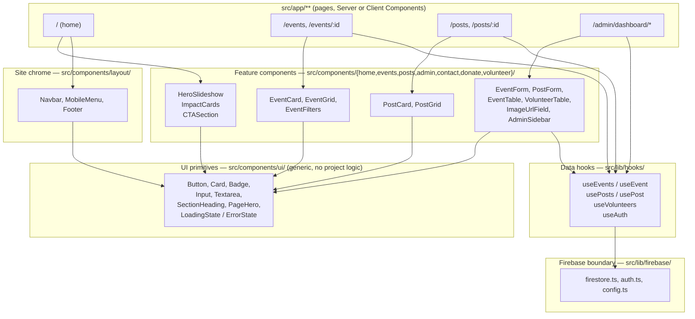

# Architecture

This document explains what the JHCS website is built from and why it is put
together this way. It is written for a developer who has never opened this
repository before. For task-specific conventions (routing quirks, the Next.js
version's breaking changes, etc.) see `AGENTS.md` at the repo root — that
file is regenerated by `next dev` and takes precedence over anything here if
the two ever disagree.

The short version: this is a Next.js marketing site with an admin dashboard
bolted on, and **there is no backend**. The browser talks to Firebase
(Firestore + Auth) directly using Firebase's client SDK. Next.js's only job
is to serve React pages — it never proxies a database call.

## Tech stack

| Layer | Choice | Notes |
|---|---|---|
| Framework | Next.js 16.3.0 (App Router, Turbopack) | React Server + Client Components, file-based routing under `src/app/` |
| UI runtime | React 19.2.8 | |
| Language | TypeScript 5 | strict mode, `@/*` path alias → `src/*` (see `tsconfig.json`) |
| Styling | Tailwind CSS v4 via `@tailwindcss/postcss` | Config lives entirely in `src/app/globals.css`'s `@theme` block — **there is no `tailwind.config.ts`**, v4 doesn't read one |
| Data + auth | Firebase 12 (Firestore, Firebase Auth) | Client SDK only, called straight from the browser |
| Storage | Firebase Cloud Storage — **not enabled** | Project stays on the free Spark plan; see [Images](#images-no-cloud-storage) below |
| Animation | framer-motion 13 | |
| Icons | lucide-react, `@icons-pack/react-simple-icons` | |
| Notifications | react-hot-toast | mounted once via `ToasterProvider` |
| Admin table | `@tanstack/react-table` | powers the volunteers table |
| Dates | date-fns | formatting + the "upcoming"/"past" status calculation |
| Hosting | Vercel | auto-deploys on every push to `main`, no staging environment |
| Source control | GitHub — `github.com/thorisomoteane/jhcs-website` | |
| Testing | none | no automated tests exist in this repo |

## System context

The most important architectural fact about this app: **there is no
application server**. Next.js/Vercel serves static and server-rendered pages,
but all dynamic data — events, posts, volunteer applications, admin sign-in —
flows directly between the visitor's browser and Firebase. Next.js never sits
in the middle of a data request.



Two consequences fall out of this shape:

- **Firestore Security Rules (`firestore.rules`) are the real access-control
  layer**, not any server-side check — because there is no server to check
  anything. `AdminGuard` (see [Auth](#auth)) is a UX convenience only.
- **The two halves of "deployment" are independent.** Pushing to `main`
  redeploys the Next.js app on Vercel; it does nothing to Firestore/Storage
  rules, which only change when someone pastes them into the Firebase
  Console (or runs the Firebase CLI) and clicks Publish. These two systems
  have drifted out of sync before — the `posts` collection existed in
  `firestore.rules` in the repo for a while before the live rules were
  updated, so every post-create silently failed with "Missing or
  insufficient permissions" until someone manually republished the rules.

## Folder structure

```
src/
├── app/            # Routes only — App Router file conventions (page.tsx /
│                    # layout.tsx per folder = URL segment). See "Routing" below.
├── components/
│   ├── ui/          # Generic, content-agnostic primitives (Button, Card,
│   │                 # Badge, Input, Textarea, SectionHeading, PageHero, States)
│   ├── layout/       # Site chrome: Navbar, MobileMenu, Footer
│   ├── home/         # Homepage-only sections: HeroSlideshow, ImpactCards, CTASection
│   ├── events/       # Event feature: EventCard, EventGrid, EventFilters
│   ├── posts/        # Post feature: PostCard, PostGrid
│   ├── contact/      # Contact-page content: ContactInfo, MapEmbed, SocialLinks
│   ├── donate/       # Donate-page content: BankingDetails, DonationBreakdown
│   ├── volunteer/    # Volunteer-page content: VolunteerForm
│   ├── admin/         # Whole admin surface: AdminGuard, AdminSidebar, EventForm,
│   │                 # PostForm, ImageUrlField, EventTable, PostTable, VolunteerTable
│   └── providers/    # App-wide React providers: ToasterProvider
├── lib/
│   ├── firebase/     # Firebase SDK boundary: config.ts (lazy singletons),
│   │                 # auth.ts, firestore.ts (all CRUD), storage.ts (unused, see below)
│   ├── hooks/        # Data-fetching hooks + AuthProvider/useAuth (see below)
│   ├── constants/    # site.ts (nav links, mission copy, site config), theme.ts
│   └── utils/        # cn.ts (classname merge), dates.ts, errors.ts
└── types/            # event.ts, post.ts, volunteer.ts — one file per collection
```

`src/app/` (routing) is not expanded above because it mirrors the URL space
directly:

```
/                              home
/about                         about
/events, /events/[id]          events list (client) + detail (client)
/posts, /posts/[id]            news list (client) + detail (client)
/donate
/volunteer
/contact
/admin/login
/admin/dashboard               overview  ┐
/admin/dashboard/events        ├ all gated by AdminGuard,
/admin/dashboard/posts         ├ mounted via admin/dashboard/layout.tsx
/admin/dashboard/volunteers    ┘
error.tsx, not-found.tsx       root-level App Router error/404 conventions
```

Two routing details worth knowing up front:

- `src/app/admin/layout.tsx` mounts `AuthProvider` around the `/admin`
  subtree **only** — not the root layout — so the Firebase Auth
  listener/bundle never loads on public marketing pages.
- `events/page.tsx` and `posts/page.tsx` are Client Components (they call
  Firestore-backed hooks), and Next 16 restricts `metadata` exports to
  Server Components — so their `metadata` lives in sibling `layout.tsx`
  files (`events/layout.tsx`, `posts/layout.tsx`) instead.

Top-level repo files worth knowing about beyond `src/`: `firestore.rules` and
`storage.rules` (Firebase Security Rules, deployed independently — see
[System context](#system-context)), `next.config.ts` (the `images.
remotePatterns` allowlist, currently just `firebasestorage.googleapis.com`),
and `public/` (static assets: SVG placeholders, `public/images/`).

## Data model

Three Firestore collections, each with a matching pair of TypeScript
interfaces in `src/types/`: an app-facing type with real `Date` objects, and
a `*Document` type with Firestore `Timestamp` objects. Mapper functions in
`src/lib/firebase/firestore.ts` (`mapEvent`, `mapPost`, `mapVolunteer`)
convert `*Document` → app type on every read.



There are no relationships between the three collections — each is a flat,
independent Firestore collection (`events`, `posts`,
`volunteer_applications`), and none references another by id. Notes:

- `Event.status` is not stored as the source of truth so much as it is
  recomputed — `getEventStatus(date)` in `src/lib/utils/dates.ts` compares
  against `new Date()` — and then written back to Firestore on
  create/update in `firestore.ts` so list queries can filter/sort without
  reading every document's date client-side.
- `imagePath` exists on `Event`/`Post` for a Cloud Storage object path, but
  since Storage isn't enabled it's always unused/null in practice — see
  [Images](#images-no-cloud-storage).
- `VolunteerApplication` has no `updatedAt`; only `status` is ever mutated
  post-creation, via `updateVolunteerStatus(id, status)`.

## Component layering

Three layers, each only depending on the one below it. Pages compose feature
components; feature components compose UI primitives; UI primitives depend on
nothing project-specific.



`Navbar`/`Footer` (`L1`) are mounted once in the root layout, so in practice
every page under `src/app/` renders through them — the single `P1 --> L1`
edge above stands in for all four page groups to keep the diagram readable.

`src/components/ui/` is deliberately generic — nothing in that folder
imports a type from `src/types/` or calls into `src/lib/firebase/`. Every
button, card, and badge across the whole site (public pages and admin alike)
reuses these same primitives — there is no per-page bespoke styling.

## The hooks pattern (`useFirestoreCollection` / `useFirestoreDoc`)

This is the one abstraction most likely to trip up a new contributor, so it
gets its own section.

All Firestore reads on the client go through two generic hooks in
`src/lib/hooks/`:

- **`useFirestoreCollection<T>(fetcher, fallbackError)`** — for list views.
  Returns `{ items, loading, error, refetch }`.
- **`useFirestoreDoc<T>(id, fetcher, fallbackError)`** — for detail views.
  Returns `{ item, loading, error }`.

Every other data hook is a thin, feature-specific wrapper around one of
these two — it just supplies the right Firestore function and error string:

```
useFirestoreCollection ──► useEvents()      (wraps getEvents)
                       └──► usePosts()       (wraps getPosts)
                       └──► useVolunteers()  (wraps getVolunteerApplications)

useFirestoreDoc        ──► useEvent(id)      (wraps getEventById)
                       └──► usePost(id)      (wraps getPostById)
```

(`useAuth` is a separate, unrelated hook — a plain React Context around
Firebase Auth's `onAuthStateChanged`, defined alongside `AuthProvider` in
`src/lib/hooks/useAuth.tsx`. It doesn't go through either Firestore hook.)

Two things about the two generic hooks are non-obvious and easy to get
wrong if you're extending or copying this pattern:

1. **Loading/error state is seeded from `isFirebaseConfigured()` during
   render, not corrected inside the effect.** `isFirebaseConfigured()`
   checks that all six `NEXT_PUBLIC_FIREBASE_*` env vars are present. If
   they're missing, `loading` starts `false` and `error` starts as
   `FIREBASE_NOT_CONFIGURED` immediately — the effect body returns early
   and never touches Firebase at all. This is what makes an unconfigured
   project fail gracefully (a message in the UI) rather than throwing.
2. **The actual fetch runs inside an `async` IIFE inside `useEffect`,
   rather than a named async function whose promise is awaited
   synchronously in the effect body.** This is deliberate: calling
   `setState` synchronously inside the effect body (before any `await`) is
   what `eslint-plugin-react-hooks`'s set-state-in-effect rule flags as a
   cascading-render risk. Wrapping the whole body in `void (async () => {
   ... })()` pushes every `setState` call past an `await`, which satisfies
   the rule. If you add a third hook in this family, copy this shape rather
   than "simplifying" it back to a synchronous call.

Both hooks also guard against a stale response clobbering state after
unmount/re-run, via a local `{ cancelled: false }` flag checked after each
`await` — not `AbortController` (the Firestore SDK calls aren't
abort-aware), just a closure flag flipped in the effect's cleanup function.

`useFirestoreCollection`'s `refetch` is the one place a `setState` call is
allowed to run synchronously (setting `loading` before the `await`) — it's
called from event handlers (after a create/update/delete in the admin
forms), never from inside an effect, so the cascading-render concern above
doesn't apply to it.

## Auth

Email/password only, via Firebase Auth (`src/lib/firebase/auth.ts`:
`signIn` / `signOut` / `subscribeToAuth`). `AuthProvider` (in
`src/lib/hooks/useAuth.tsx`) wraps `subscribeToAuth` in a React Context and
exposes it as `useAuth()`. `AdminGuard`
(`src/components/admin/AdminGuard.tsx`) reads `useAuth()`, shows a loading
spinner while the auth state resolves, and redirects to `/admin/login` if no
user is signed in.

**This is a UX gate only.** As the comment in `AdminGuard.tsx` states
directly, the real access control is Firestore Security Rules — see
[System context](#system-context) above. Currently `firestore.rules` allows
*any* signed-in Firebase user to write to `events` and `posts` (the stricter
UID-allowlist `isAdmin()` helper is written but commented out), so tightening
this before real self-serve sign-up is ever enabled is an open item, not a
finished one.

## Images: no Cloud Storage

Firebase Cloud Storage requires the paid Blaze plan; this project
deliberately stays on the free Spark plan, so Storage was never enabled.
Consequently:

- `EventForm` / `PostForm` (`src/components/admin/`) do not upload files.
- `ImageUrlField` (`src/components/admin/ImageUrlField.tsx`) is a plain URL
  text input with a live `` preview — admins paste a link to an image
  already hosted elsewhere (Unsplash, imgur, etc.).
- `EventCard`, `PostCard`, and the `[id]` detail pages render that pasted
  URL through `next/image` with the `unoptimized` prop, because Next's
  built-in image optimizer only fetches from hosts listed in
  `next.config.ts`'s `images.remotePatterns` (currently just
  `firebasestorage.googleapis.com`, unused today) — and an admin-pasted URL
  can be literally any host.
- `src/lib/firebase/storage.ts` still contains working (but unused) upload/
  delete functions, and `storage.rules` still exists at the repo root — both
  kept ready to wire back in if the project ever upgrades to Blaze.

## Known caveats

- `firestore.rules`' `isAdmin()` UID allowlist is written but commented
  out — any authenticated Firebase user can currently write to every
  collection.
- Cloud Storage is not enabled (Spark plan) — image "uploads" are actually
  pasted URLs; `storage.rules` is unused until the project upgrades to
  Blaze.
- Donate-page banking details fall back to placeholder values
  (`getSiteConfig()` in `src/lib/constants/site.ts`) until real
  `NEXT_PUBLIC_BANK_*` env vars are set.
- No automated tests exist in this repo.
- Editing `firestore.rules` or `storage.rules` in this repo has **no effect
  on production** until someone manually pastes the updated rules into the
  Firebase Console (Firestore Database → Rules → Publish, or the
  Storage-rules equivalent) — see [System context](#system-context).
