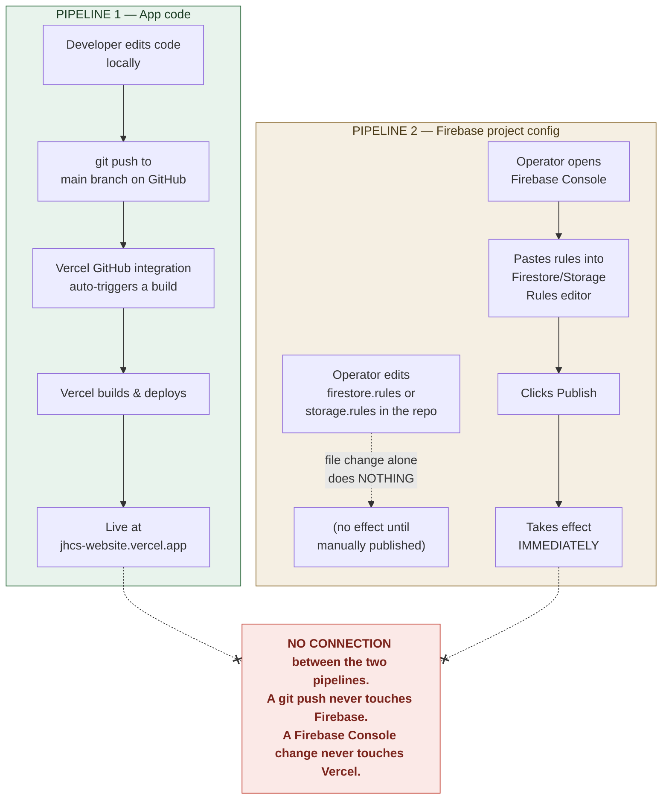

# Deployment & Operations Runbook — JHCS Website

This document is for whoever is operating this site day-to-day. You do not
need to be a developer to follow it, but you do need access to two separate
accounts:

- **GitHub** — `github.com/thorisomoteane/jhcs-website` (the code)
- **Vercel** — the hosting platform that builds and serves the live site
- **Firebase Console** — `console.firebase.google.com`, project **jhcs-website**
  (the database, authentication, and security rules)

The single most important thing to understand before touching anything is
this: **these are two separate systems that do not talk to each other.**
Pushing code to GitHub never changes Firebase. Publishing rules in the
Firebase Console never changes the deployed app. See the diagram below, and
see the Troubleshooting section for a real incident this caused.

---

## 1. The two deploy pipelines

**Plain-language summary:**

| | Pipeline 1: App code | Pipeline 2: Firebase config |
|---|---|---|
| What it changes | Pages, components, styling, logic — everything under `src/` | Firestore/Storage security rules, Auth users, Storage plan |
| Where you edit | Your local code editor | Firebase Console (web UI) |
| How it ships | `git push` to `main` → Vercel auto-deploys | Manually paste rules into Console → click **Publish** |
| Takes effect | A minute or two after push (Vercel build time) | Immediately on Publish |
| Automated? | Yes — every push to `main` deploys | No — nobody does this for you, ever |
| Undo | `git revert` + push, or redeploy an older build in Vercel | Manually paste the previous rules and Publish again |

There is no staging environment and no automated test gate for either
pipeline. A push to `main` **is** the production deploy. A rules Publish
**is** the production security policy, instantly, for every visitor.

---

## 2. How to ship a code change

1. **Make the change locally** in the repo at your working copy of
   `jhcs-website`, and confirm it works with `npm run dev` at
   `http://localhost:3000`.
   - Local dev reads Firebase credentials from `.env.local` (see Section 4).
     Without it, the site still runs but shows "Firebase is not configured"
     wherever it needs data.
   - Optionally, run `npm run build` locally before pushing. Some errors
     (type errors, static-generation issues) only surface during a
     production build, not in `npm run dev` — catching them locally is
     faster than watching a Vercel build fail.
2. **Lint before committing**: `npm run lint`.
3. **Commit** with a normal `git commit`. If you're on `main`, create a
   branch first — don't commit straight to `main` unless the project's
   working agreement says otherwise.
4. **Push to GitHub**: `git push origin <branch>`, open a PR, merge to
   `main` (or push directly to `main` if that's the agreed workflow for this
   project).
5. **Vercel takes over automatically.** The GitHub integration detects the
   push to `main` and starts a build. No one needs to log into Vercel to
   trigger this.
6. **Watch the build** in the Vercel dashboard (Project → Deployments) if
   you want to confirm it went well. A failed build does **not** replace the
   live site — the previous successful deploy keeps serving traffic until a
   new build succeeds.
7. **Verify on the live site**: open `jhcs-website.vercel.app` (or the
   custom domain, if one has been connected in Vercel → Project Settings →
   Domains — this app's `NEXT_PUBLIC_SITE_URL` default of
   `https://jhcs.org.za` suggests that's the intended long-term production
   domain, so confirm which one is actually live before assuming) and check
   the change actually shipped (hard-refresh / open in a private window —
   browsers cache aggressively).
8. **If something breaks in production**: in the Vercel dashboard, open
   Deployments, find the last known-good deployment, and use "Promote to
   Production" (or equivalent redeploy action) to roll back instantly while
   you fix the code.

**About pull requests and Preview Deployments:** if this project has
Vercel's default GitHub integration behavior enabled, pushing a branch or
opening a PR (step 4, before merge) also builds a separate **Preview
Deployment** at its own throwaway URL — distinct from the production
deployment at `jhcs-website.vercel.app`. That's expected and useful for
checking a change before it merges, but don't mistake a preview URL working
for the production site having shipped — only a build triggered by a push
to `main` updates production.

Remember: this pipeline **never** touches Firestore Security Rules, Storage
rules, or Auth users. If your change depends on a rules update (e.g. you
added a new Firestore collection), you must **also** do Section 3 — and do
it, ideally, before or immediately after the code goes live, not "eventually."

---

## 3. How to publish a Firestore/Storage rules change

The Firebase CLI is **not installed or authenticated** in this project's dev
environment, so rules are published by hand through the Firebase Console web
UI. (The `firebase deploy --only firestore:rules` / `--only storage`
commands referenced in the comments at the top of `firestore.rules` and
`storage.rules` are the CLI-based alternative — usable if the CLI is ever
set up, but not the current workflow.)

### Publishing a Firestore rules change

1. Edit `firestore.rules` in the repo and get the change reviewed/merged
   like any other code change (this keeps the repo copy as the source of
   truth for what rules *should* be).
2. Open the [Firebase Console](https://console.firebase.google.com) →
   select project **jhcs-website**.
3. In the left sidebar, go to **Build → Firestore Database**.
4. Click the **Rules** tab.
5. Select all the text in the editor and replace it with the exact
   contents of the repo's `firestore.rules`.
6. Click **Publish**.
7. The new rules are live immediately — no build, no wait, no deploy step.
8. Sanity-check the affected feature on the live site right away (e.g. if
   you changed the `posts` rules, try creating a post from
   `/admin/dashboard/posts`).

### Publishing a Storage rules change

Same process, different section:

1. Firebase Console → **Build → Storage** → **Rules** tab.
2. Replace the editor contents with the repo's `storage.rules`.
3. Click **Publish**.

Note: Storage is **not currently enabled** on this Firebase project (it's on
the free Spark plan, and Storage requires the paid Blaze plan — see Section
5's caveats). `storage.rules` exists in the repo and is ready to publish,
but it has no effect until Storage is actually turned on for the project.

### Keeping the repo and the console in sync

The repo's `firestore.rules` / `storage.rules` files are the intended source
of truth, but **Firebase has no idea the repo exists** — nothing enforces
that what's published in the Console matches what's committed. After any
rules edit, always immediately re-paste it into the Console. If you're ever
unsure whether production rules match the repo, open the Console's Rules
tab and diff it by eye against the repo file — there's no automated check.

**If a bad Publish breaks something**, you don't necessarily need the repo
to undo it: the Firestore/Storage Rules tab in the Firebase Console keeps a
history of every previously published rules version, and lets you view and
restore an older one directly from the Console. That's a faster rollback
than re-pasting from the repo if the repo's own copy is what's wrong.

---

## 4. Environment variables

All variables are `NEXT_PUBLIC_*`, meaning they are inlined into the
browser bundle at build time — there are no server-only secrets in this
app. This is expected and fine for Firebase's web config: access control is
enforced by Firestore Security Rules (Section 3), not by hiding these
values. **Do not add a real secret with a `NEXT_PUBLIC_` prefix** — it would
ship straight to every visitor's browser.

The authoritative list lives in `.env.example` at the repo root. Below is
that same list with where each variable must be set.

| Variable | Required? | Purpose | Set in `.env.local` (local dev) | Set in Vercel Project Settings (production) |
|---|---|---|---|---|
| `NEXT_PUBLIC_FIREBASE_API_KEY` | Yes | Firebase web app config | Yes | Yes |
| `NEXT_PUBLIC_FIREBASE_AUTH_DOMAIN` | Yes | Firebase web app config | Yes | Yes |
| `NEXT_PUBLIC_FIREBASE_PROJECT_ID` | Yes | Firebase web app config | Yes | Yes |
| `NEXT_PUBLIC_FIREBASE_STORAGE_BUCKET` | Yes | Firebase web app config | Yes | Yes |
| `NEXT_PUBLIC_FIREBASE_MESSAGING_SENDER_ID` | Yes | Firebase web app config | Yes | Yes |
| `NEXT_PUBLIC_FIREBASE_APP_ID` | Yes | Firebase web app config | Yes | Yes |
| `NEXT_PUBLIC_FIREBASE_MEASUREMENT_ID` | Optional | Firebase Analytics — not currently wired up in code | Optional | Optional |
| `NEXT_PUBLIC_SITE_EMAIL` | Optional (falls back to placeholder) | Shown on `/contact` and footer | Recommended | Recommended |
| `NEXT_PUBLIC_SITE_PHONE` | Optional (falls back to placeholder) | Shown on `/contact` and footer | Recommended | Recommended |
| `NEXT_PUBLIC_SITE_ADDRESS` | Optional (falls back to placeholder) | Shown on `/contact` and footer | Recommended | Recommended |
| `NEXT_PUBLIC_SITE_URL` | Optional (defaults to `https://jhcs.org.za`) | Canonical site URL | Optional | Optional |
| `NEXT_PUBLIC_BANK_NAME` | Optional (falls back to "Example Bank" placeholder) | Rendered publicly on `/donate` | **Must set before real launch** | **Must set before real launch** |
| `NEXT_PUBLIC_BANK_ACCOUNT_NAME` | Optional (placeholder fallback) | Rendered publicly on `/donate` | **Must set before real launch** | **Must set before real launch** |
| `NEXT_PUBLIC_BANK_ACCOUNT_NUMBER` | Optional (placeholder "0000000000") | Rendered publicly on `/donate` | **Must set before real launch** | **Must set before real launch** |
| `NEXT_PUBLIC_BANK_BRANCH_CODE` | Optional (placeholder fallback) | Rendered publicly on `/donate` | **Must set before real launch** | **Must set before real launch** |
| `NEXT_PUBLIC_BANK_REFERENCE` | Optional (placeholder fallback) | Rendered publicly on `/donate` | **Must set before real launch** | **Must set before real launch** |
| `NEXT_PUBLIC_SOCIAL_FACEBOOK` | Optional (placeholder fallback) | Footer/social links | Optional | Optional |
| `NEXT_PUBLIC_SOCIAL_INSTAGRAM` | Optional (placeholder fallback) | Footer/social links | Optional | Optional |
| `NEXT_PUBLIC_SOCIAL_X` | Optional (placeholder fallback) | Footer/social links | Optional | Optional |
| `NEXT_PUBLIC_SOCIAL_YOUTUBE` | Optional (placeholder fallback) | Footer/social links | Optional | Optional |

**Important gotchas:**

- **Vercel does not read `.env.local`.** It's a local-only file (and is
  git-ignored). Every variable that production needs must be entered
  separately in the Vercel dashboard: **Project → Settings → Environment
  Variables**.
- **Changing a Vercel env var does not update the live site by itself.**
  Env vars are baked into the build at build time. After adding or changing
  one in Vercel, you must trigger a new deployment (push a commit, or use
  "Redeploy" in the Vercel dashboard) for it to take effect.
- If the six `NEXT_PUBLIC_FIREBASE_*` variables aren't all present, the app
  detects this via `isFirebaseConfigured()`
  (`src/lib/firebase/config.ts`) and shows a "Firebase is not configured"
  message throughout the site instead of crashing — so a missing Firebase
  var is a visible, non-fatal degraded state, not an outage.
- The bank details on `/donate` are **public** the moment they're set —
  double check them before publishing real account numbers.

---

## 5. First-time setup checklist (brand-new Firebase project)

Use this when standing the site up against a Firebase project that has
never been configured before (e.g. a fresh clone, a new environment, or
migrating to a new Firebase project).

1. **Create the Firebase project** in the
   [Firebase Console](https://console.firebase.google.com) (or reuse the
   existing `jhcs-website` project if that's what you're pointing at).
2. **Register a Web App** inside the project: Project settings → Your apps
   → Add app → Web. Firebase will show you the `firebaseConfig` object —
   copy its six values.
3. **Enable Authentication**: Build → Authentication → Sign-in method →
   enable **Email/Password**. This app only supports email/password sign-in
   (`src/lib/firebase/auth.ts`) — there is no Google/social login and no
   self-service signup page.
4. **Create the admin user(s) manually.** There is no signup flow anywhere
   in this app. Go to Build → Authentication → Users → **Add user**, and
   create an account for each person who needs access to
   `/admin/dashboard`. Give them the email/password directly — that's how
   they'll sign in at `/admin/login`.
5. **Enable Firestore Database**: Build → Firestore Database → Create
   database. Choose a region (South Africa isn't a native Firestore region
   as of writing; pick the nearest supported region to your audience) and
   start in production mode (rules get overwritten in the next step
   anyway). **This region choice is permanent** — Firestore does not support
   changing a database's region later, so a wrong pick here means creating
   a brand-new Firebase project to fix it.
6. **Publish Firestore rules** using the process in Section 3 — paste in
   the repo's `firestore.rules` and click Publish. Skipping this step means
   the database is either wide open or fully locked depending on what mode
   you created it in, neither of which matches this app's intended
   behavior.
7. **Decide on Cloud Storage — likely skip it.** This project deliberately
   stays on Firebase's free **Spark** plan, and Cloud Storage requires the
   paid **Blaze** plan, so Storage is intentionally **not enabled**. Admins
   add images by pasting a URL to an already-hosted image (see
   `src/components/admin/ImageUrlField.tsx`), not by uploading a file. Only
   enable Storage (and then publish `storage.rules` the same way as
   Firestore) if the project has upgraded to Blaze and someone has re-wired
   the upload code in `src/lib/firebase/storage.ts` back into
   `EventForm`/`PostForm` — that file's functions
   (`uploadEventImage`/`uploadPostImage`/etc.) are fully written and correct,
   just not imported or called from anywhere yet, so this is a wiring job,
   not a from-scratch build.
8. **Collect the six Firebase config values** from step 2 and set them as
   `NEXT_PUBLIC_FIREBASE_*` variables:
   - Locally: copy `.env.example` to `.env.local` and fill them in.
   - In production: add the same six (plus any site/bank/social values you
     have) in Vercel → Project Settings → Environment Variables.
9. **Connect the GitHub repo to a Vercel project** (Vercel → Add New →
   Project → import `thorisomoteane/jhcs-website`) if this is a genuinely
   new Vercel project. Confirm the production branch is set to `main`.
10. **Trigger a deploy** (push to `main`, or manually redeploy in Vercel)
    so the newly-added env vars actually get baked into a build.
11. **Smoke test end-to-end**:
    - Visit the public site — home, `/events`, `/posts`, `/donate`,
      `/contact` all load without a "Firebase is not configured" message.
    - Go to `/admin/login`, sign in with the user created in step 4.
    - From `/admin/dashboard/events` (or `/posts`), create a test item and
      confirm it saves and appears on the public `/events` or `/posts` page.
    - Submit the `/volunteer` form as a member of the public and confirm it
      appears under `/admin/dashboard/volunteers`.
12. **Tighten `isAdmin()` before real launch.** `firestore.rules` currently
    allows **any** signed-in Firebase user to create/update/delete events
    and posts, and to read, update, or delete volunteer application records
    (only *creating* a volunteer application is open to the public, per the
    field-validation block in that rule) — there's a commented-out
    `isAdmin()` UID-allowlist helper in the rules file meant to replace
    every one of those `isSignedIn()` checks once you know your real admin
    UIDs (get each UID from Authentication → Users after step 4). Uncomment
    it, list the admin UIDs, swap it in for `isSignedIn()` everywhere that
    function is used in the rules file (events create/update/delete, posts
    create/update/delete, and volunteer_applications read/update/delete),
    and publish per Section 3.
13. **Set real bank details** (`NEXT_PUBLIC_BANK_*`) before pointing anyone
    at `/donate` for real — until set, the page shows an obviously-fake
    placeholder ("Example Bank", account `0000000000`).

---

## 6. Troubleshooting

### "Missing or insufficient permissions" when creating/saving something in the admin dashboard

This is the single most common failure mode in this project, and it has
already happened once in production. **Worked example — the real incident:**

> The repo's `firestore.rules` included a `posts` collection block from the
> very first commit. But the *live* rules actually published in the
> Firebase Console had never been updated to match — they predated the
> `posts` collection entirely. Every attempt to create a post from
> `/admin/dashboard/posts` failed with `Firebase: Missing or insufficient
> permissions (permission-denied)`, even though the code was correct, the
> admin was signed in, and the rules *file in the repo* clearly allowed it.
> The fix was not a code change at all: someone had to open the Firebase
> Console → Firestore Database → Rules, paste in the current
> `firestore.rules`, and click Publish. The moment that happened, post
> creation worked — no redeploy, no new code, nothing on the Vercel side
> changed.

**Why this happens:** this is the two-pipelines trap from Section 1. Editing
`firestore.rules` in the repo and even merging/deploying that change through
Vercel does **nothing** to the rules actually enforced by Firestore. Rules
only take effect when manually pasted into the Firebase Console and
published (Section 3). It is very easy to merge a rules change, watch
Vercel deploy successfully, and assume the whole thing "shipped" — because
from the code's perspective, it did. The database never heard about it.

**How to diagnose it:**

1. Open the Firebase Console → Firestore Database → **Rules** tab.
2. Compare what's shown there against the repo's `firestore.rules`
   (currently on `main`). If they differ at all, that's very likely your bug.
3. Paste the repo version in and click **Publish**.
4. Retry the failing action immediately — no waiting, no redeploy needed.

### Public pages show "Firebase is not configured"

One or more of the six `NEXT_PUBLIC_FIREBASE_*` env vars is missing for the
environment you're looking at.

- **Locally**: check `.env.local` exists and has all six values, then
  restart `npm run dev` (env vars are only read at process start).
- **In production**: check Vercel → Project Settings → Environment
  Variables has all six, then trigger a new deployment — adding/changing a
  Vercel env var does not retroactively affect an already-built deployment.

### A code change is live on GitHub/main but not on the live site

- Check Vercel → Deployments for a failed build. A failed build doesn't
  replace the live site, so the site may simply still be serving the
  previous successful deploy while the new one errors out.
- Confirm the push actually landed on `main` — Vercel's production
  deployments are typically wired to that branch specifically.
- Hard-refresh / try a private browser window before concluding nothing
  changed — this is very often just browser or CDN caching.

### An admin can't sign in at `/admin/login`

- Confirm the account exists: Firebase Console → Authentication → Users.
  There is no self-signup anywhere in this app (`src/lib/firebase/auth.ts`
  only exposes `signIn`/`signOut`/`subscribeToAuth` — it never calls
  Firebase's `createUserWithEmailAndPassword`), so if the user doesn't exist
  there, they cannot ever sign in no matter what code is deployed. Add them
  manually (Section 5, step 4).
- Confirm Email/Password sign-in is enabled: Authentication → Sign-in
  method.
- Being signed in only gets an admin past `AdminGuard`
  (`src/components/admin/AdminGuard.tsx`), which is a UX gate. If reads or
  writes still fail after signing in successfully, that's a rules problem
  (see the first item above), not a login problem.

### Images not showing / broken image icon on an event or post

This app has no Cloud Storage — admins paste a URL to an image hosted
elsewhere (via `ImageUrlField.tsx`). If an image doesn't load, the pasted
URL itself is almost always the problem (wrong link, image deleted at the
source, or the source requires authentication) — check the URL in a browser
tab directly. This is unrelated to both deploy pipelines.
