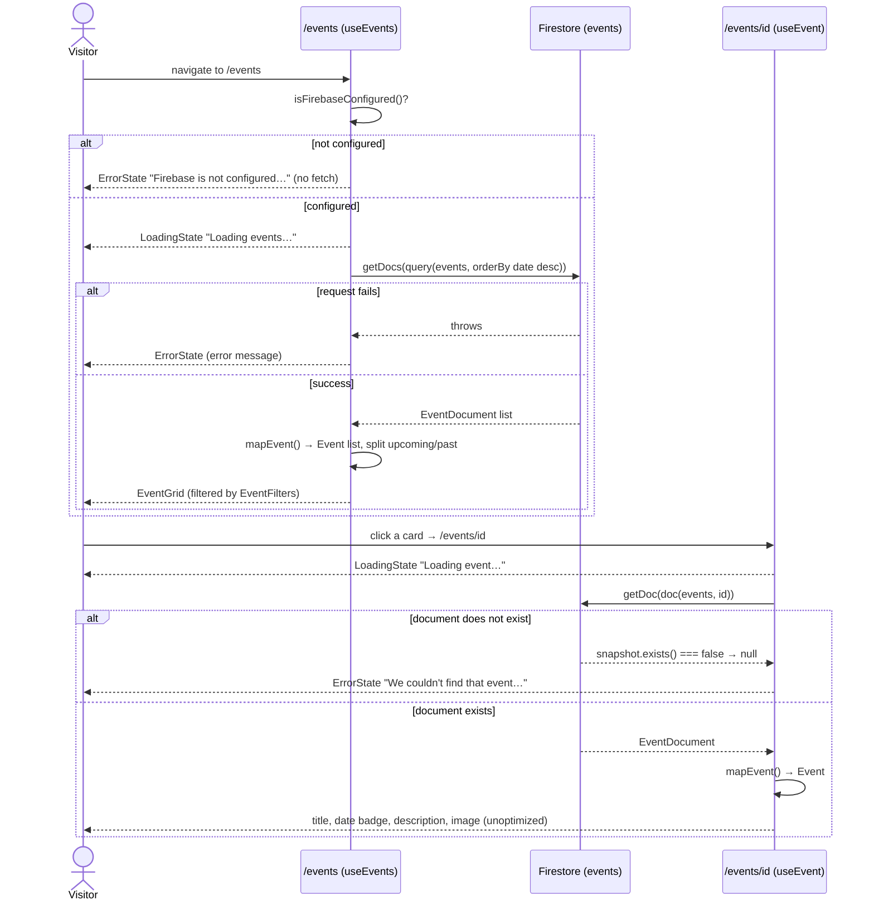
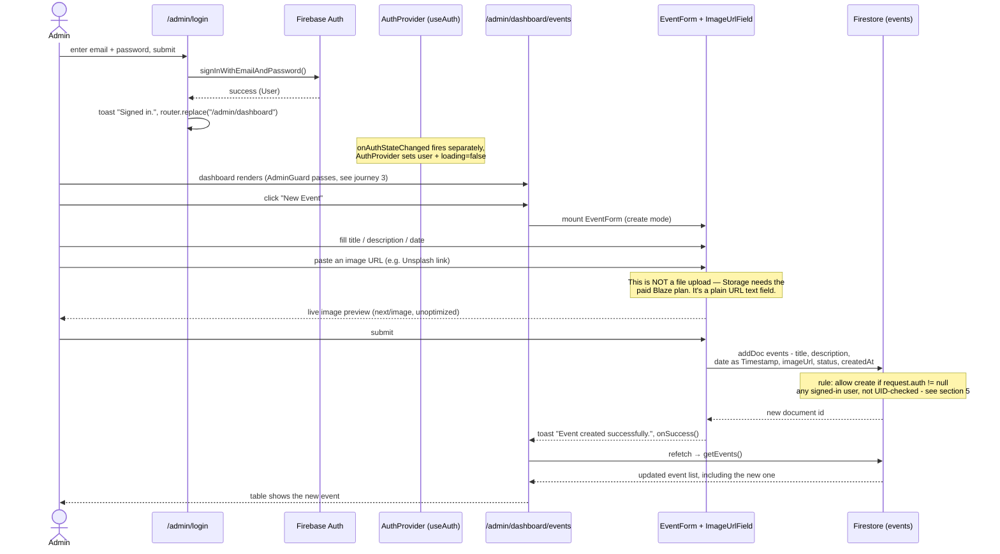
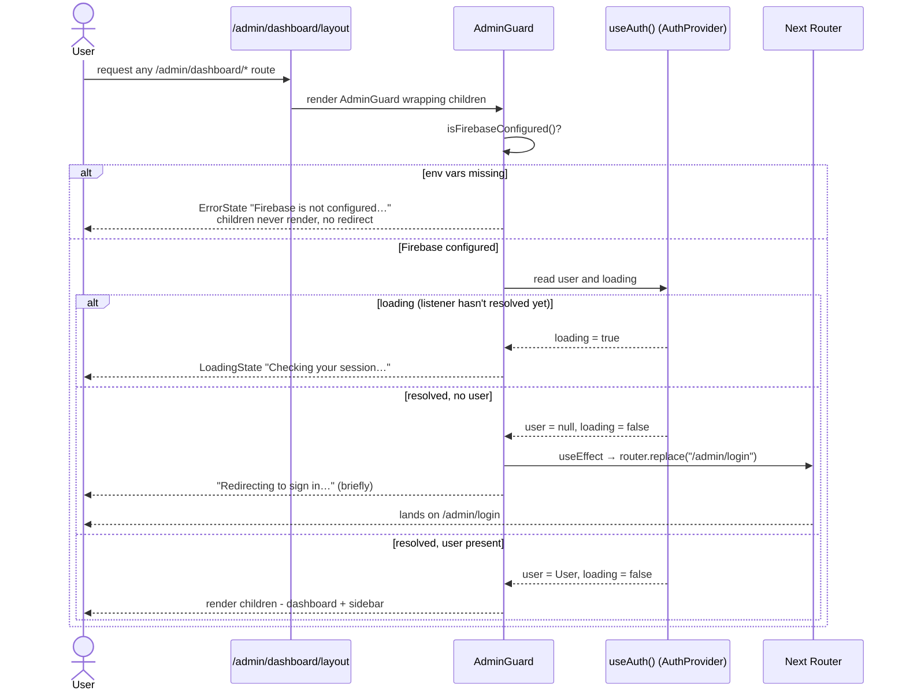
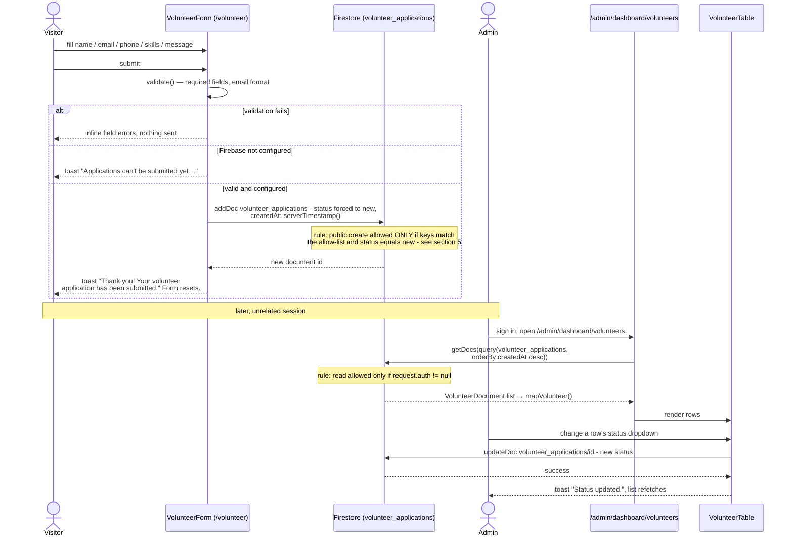

# How JHCS Website Actually Works

This document walks through what really happens, request by request, when
someone uses the Jan Hofmeyer Community Services (JHCS) website. It is not a
file map — see `AGENTS.md` for that — it's a trace of data as it moves
through the app.

The one fact that explains almost everything below: **there is no backend.**
`src/lib/firebase/firestore.ts` is marked `"use client"` and every function
in it — `getEvents`, `createEvent`, `createVolunteerApplication`, all of it —
runs in the visitor's or admin's browser, talking straight to Firestore over
Google's client SDK. There is no Next.js API route, no server action, no
middleware in between. That single fact is why the loading/error states are
everywhere (a browser-to-cloud round trip can fail in ways a same-origin
fetch usually doesn't), why both `AdminGuard.tsx` and the top-of-file comment
in `firestore.rules` independently describe the admin sign-in screen as a
"UX gate, not a security boundary," and why Firestore Security Rules — not
any line of application code — are the actual access-control layer. The
last section of this document explains that in detail.

## Contents

1. [A visitor browses `/events` and opens one](#1-a-visitor-browses-events-and-opens-one)
2. [An admin signs in and creates an event with a cover image](#2-an-admin-signs-in-and-creates-an-event-with-a-cover-image)
3. [The auth/guard flow: what `AdminGuard` actually checks](#3-the-authguard-flow-what-adminguard-actually-checks)
4. [A visitor submits the volunteer form; it shows up in the admin table](#4-a-visitor-submits-the-volunteer-form-it-shows-up-in-the-admin-table)
5. [Why Firestore Security Rules are the real access-control boundary](#5-why-firestore-security-rules-are-the-real-access-control-boundary)

---

## 1. A visitor browses `/events` and opens one

`/events` (`src/app/events/page.tsx`) is a Client Component — it has to be,
because it calls `useEvents()`, which ultimately calls the Firestore client
SDK, and the SDK only runs in the browser. That's also why its page
metadata lives in the sibling `src/app/events/layout.tsx` instead: Next 16
only allows `export const metadata` in Server Components.

`useEvents()` is a one-line wrapper around the generic
`useFirestoreCollection` hook (`src/lib/hooks/useFirestoreCollection.ts`),
which owns all of the loading/error plumbing shared by every listing page in
the app. Two details worth knowing about it:

- It checks `isFirebaseConfigured()` (`src/lib/firebase/config.ts`) **during
  render**, not inside the effect, so a misconfigured deploy (missing
  `NEXT_PUBLIC_FIREBASE_*` env vars) renders straight to the "Firebase is not
  configured" error state and never even calls Firestore.
- The actual fetch happens inside an `async` IIFE inside `useEffect`, on
  purpose, so no `setState` call happens synchronously in the effect body
  (see the comment in the file — this satisfies
  `eslint-plugin-react-hooks`' set-state-in-effect rule).

`getEvents()` (`src/lib/firebase/firestore.ts`) runs
`getDocs(query(collection(getDb(), "events"), orderBy("date", "desc")))` and maps
each `EventDocument` (Firestore `Timestamp` fields) to an app-facing `Event`
(real `Date` objects) via `mapEvent()`. (`getDb()` is a lazy singleton getter
in `src/lib/firebase/config.ts`, not a plain exported `db` — same reasoning
as `isFirebaseConfigured()` above: initializing Firebase at module scope
would throw the moment an unconfigured build imports this file, instead of
letting the UI render a graceful error.) Back in `EventsPage`, events are
split into `upcoming`/`past` client-side by comparing against
`getEventStatus()` (`src/lib/utils/dates.ts`), and `EventFilters` toggles
which bucket `EventGrid` renders.

Clicking a card navigates to `/events/[id]`
(`src/app/events/[id]/page.tsx`), also a Client Component. Next 16 makes
route `params` a `Promise`, so it's unwrapped with React's `use()` rather
than `await` (a Server Component convention this page can't use).
`useEvent(id)` wraps the sibling hook `useFirestoreDoc`, which fetches a
single doc with `getEventById()` → `getDoc(doc(getDb(), "events", id))`. If the
document doesn't exist, `snapshot.exists()` is `false` and `getEventById`
returns `null` — the page treats a `null` item (once loading is finished and
there's no error) as "not found" and shows a dedicated `ErrorState`, not a
generic error.

The cover image, if present, renders through `next/image` with the
`unoptimized` prop — required because it's a URL an admin pasted from any
host, not one of the hosts allow-listed in `next.config.ts`'s
`images.remotePatterns` (see journey 2).

## 2. An admin signs in and creates an event with a cover image

Start at `/admin/login` (`src/app/admin/login/page.tsx`). Submitting the
form calls `signIn(email, password)` (`src/lib/firebase/auth.ts`), a thin
wrapper over Firebase Auth's `signInWithEmailAndPassword`. On success the
page shows a toast and calls `router.replace("/admin/dashboard")` itself —
it doesn't wait for the auth context to catch up. Separately, in the
background, the `onAuthStateChanged` listener that `AuthProvider`
(`src/lib/hooks/useAuth.tsx`) subscribed to on mount fires and updates
`{ user, loading }` in React context; by the time the dashboard route's
`AdminGuard` renders, that context already (or very shortly) reflects the
signed-in user. (Journey 3 covers `AdminGuard` in full.)

Once inside `/admin/dashboard/events`, clicking **New Event** mounts
`EventForm` (`src/components/admin/EventForm.tsx`) with a blank
`EventFormData`. The cover-image field is `ImageUrlField`
(`src/components/admin/ImageUrlField.tsx`) — and this is the detail worth
being explicit about: **it is a plain `<input type="url">`, not a file
picker.** There is no upload happening anywhere in this flow. The component's
own doc comment spells out why:

> File uploads need somewhere to live — Firebase Storage — which requires
> the Blaze (pay-as-you-go) plan. This project is deliberately staying on
> the free Spark plan for now, so admins paste a link to an image already
> hosted elsewhere (Unsplash, imgur, your own site) instead.

So "uploading a cover image" really means: the admin finds an image already
hosted somewhere else, copies its URL, and pastes it into that text field.
`ImageUrlField` renders a live `next/image` preview of whatever URL is
currently typed (also `unoptimized`, for the same reason as the detail page:
Next's image optimizer only fetches from `next.config.ts`'s allow-listed
hosts, and an admin-pasted URL can be anything), and shows a broken-image
placeholder via the `<Image onError>` handler if the link doesn't resolve to
an image. `src/lib/firebase/storage.ts` still contains working
`uploadEventImage`/`deleteEventImage`/`uploadPostImage`/`deletePostImage`
functions from before this decision. They are not commented out — they're
live, correct code — but nothing in the app imports or calls them; a comment
at the top of the file spells out that they're kept, ready to be wired back
into `EventForm`/`PostForm` in place of `ImageUrlField` if the project ever
upgrades to Blaze.

On submit, `EventForm` calls `createEvent()`
(`src/lib/firebase/firestore.ts`), which computes `status` from the date via
`getEventStatus()`, converts the JS `Date` to a Firestore `Timestamp`, and
calls `addDoc(collection(getDb(), "events"), {...})` — a write issued directly
from the admin's browser to Firestore, authorized purely by Firestore
Security Rules checking `request.auth != null` (see journey 5). On success,
`EventForm` calls `onSuccess()`, which the admin events page wires to
`refetch()` on its own `useEvents()` call, so the table re-fetches the full
list and the new event appears.

## 3. The auth/guard flow: what `AdminGuard` actually checks

`AdminGuard` (`src/components/admin/AdminGuard.tsx`) wraps everything under
`/admin/dashboard` — it's mounted once in
`src/app/admin/dashboard/layout.tsx`, alongside `AdminSidebar`. `AuthProvider`
itself is mounted one level up, in `src/app/admin/layout.tsx`, deliberately
*not* the root layout — the code comment there explains this keeps the
Firebase Auth listener (and its JS bundle) out of every public marketing
page; only the `/admin/*` subtree pays that cost.

`AdminGuard`'s own doc comment states its role plainly:

> Client-side gate for the dashboard. Note this is a UX guard, not a
> security boundary — the real enforcement lives in Firestore Security
> Rules, since every read/write here goes straight from the browser to
> Firebase.

On every render it evaluates two independent things and produces one of four
outcomes:

1. **`isFirebaseConfigured()` is `false`** (missing env vars): renders an
   `ErrorState` with the "Firebase is not configured" message and stops —
   `children` never render, and no redirect happens either, because there's
   nothing to check the user *against*.
2. **`configured` but `useAuth()` still has `loading: true`** (the
   `onAuthStateChanged` listener hasn't reported back yet — this is the
   normal state for a split second on every hard page load/refresh): renders
   a `LoadingState` ("Checking your session…").
3. **`configured`, not loading, `user` is `null`**: an effect fires
   `router.replace("/admin/login")`. While that navigation is in flight the
   guard renders a small "Redirecting to sign in…" message with a manual
   link, in case the client-side redirect is slow.
4. **`configured`, not loading, `user` is present**: renders `children` —
   the actual dashboard page.

## 4. A visitor submits the volunteer form; it shows up in the admin table

`/volunteer` renders `VolunteerForm`
(`src/components/volunteer/VolunteerForm.tsx`), a public, unauthenticated
form — no sign-in required to submit it. On submit it runs its own
client-side `validate()` (name/email/phone required, a simple email regex)
before touching the network at all. If `isFirebaseConfigured()` is `false`
it shows a toast asking the visitor to email or call instead, without
attempting a write. Otherwise it calls `createVolunteerApplication()`
(`src/lib/firebase/firestore.ts`), which `addDoc`s into the
`volunteer_applications` collection with `status` hardcoded to `"new"` and
`createdAt: serverTimestamp()`.

This write is a public, unauthenticated `addDoc` from an anonymous visitor's
browser — nothing in the app code gates it. What actually keeps this
collection from becoming a spam/abuse vector is `firestore.rules`' `create`
rule, which restricts the payload's keys to an allow-list (`hasOnly(...)` —
no extra fields can be smuggled in, though it doesn't force every listed
field to be present), requires `name`/`email`/`phone` to be strings within
size limits, and requires `status` to literally equal `"new"` — a visitor's
browser cannot, for example, `addDoc` a pre-set `status: "archived"` or add
a field like `pinned: true` that isn't on the list.

Reading the submissions back is a completely separate, unrelated code path:
`/admin/dashboard/volunteers` (`src/app/admin/dashboard/volunteers/page.tsx`)
sits behind `AdminGuard` like every other dashboard route, and calls
`useVolunteers()` → `getVolunteerApplications()` →
`getDocs(query(volunteer_applications, orderBy("createdAt", "desc")))`.
`firestore.rules` requires `isSignedIn()` for any `read` on this collection,
so a signed-out visitor — even one who knows the collection name — cannot
list or read these documents; only an authenticated admin session can.
`VolunteerTable` (`src/components/admin/VolunteerTable.tsx`, built on
`@tanstack/react-table`) renders the rows, and its status `<select>` calls
`updateVolunteerStatus(id, status)` → `updateDoc(...)` on change, then
`onRefresh()` to re-fetch.

## 5. Why Firestore Security Rules are the real access-control boundary

Every journey above converges on the same structural fact: **this app has no
server component in the traditional sense.** `firestore.ts` is `"use
client"` end to end. When `EventForm` calls `createEvent()`, the `addDoc()`
call executes in the admin's own browser tab, using credentials (the
Firebase Auth ID token) that also live in that browser tab. There is no
Next.js API route, no server action, and no middleware sitting between the
browser and Firestore that could double-check the request server-side. The
comment at the top of `firestore.rules` says this outright:

> Context: this app has no server. Every read and write below is issued
> directly from the browser, so these rules are the ONLY thing standing
> between the public internet and your data. The admin sign-in screen is a
> UX gate, not a security boundary.

Concretely, that means `AdminGuard` redirecting a signed-out visitor to
`/admin/login` stops that visitor's *browser tab* from rendering the
dashboard UI — but it does nothing to stop a technically-inclined visitor
from opening the browser console on any page and calling the Firestore SDK
directly (or hitting Firestore's REST/gRPC endpoints with `curl`), bypassing
`AdminGuard` and the React tree entirely. The only thing that can actually
refuse that request is Firestore evaluating `firestore.rules` against the
caller's auth token, server-side, on Google's infrastructure. That's the
real boundary.

What today's `firestore.rules` (repo root) actually enforces, collection by
collection:

- **`events` / `posts`** — `read` is public (`allow read: if true`);
  `create`/`update`/`delete` require `isSignedIn()`, i.e.
  `request.auth != null`. That check has one significant gap, called out
  directly in the rules file's own comment: `isSignedIn()` accepts *any*
  authenticated Firebase user, not specifically an admin. There's a
  commented-out `isAdmin()` helper in the same file, meant to check
  `request.auth.uid` against a hardcoded allow-list of real admin UIDs, but
  it has not been switched on. Until it is, anyone who can create a Firebase
  Auth account on this project (or is handed credentials for any reason)
  can write to `events` and `posts` — not just the intended admins.
- **`volunteer_applications`** — public `create` is allowed, but only if the
  submitted document's keys are drawn from an allow-list (`hasOnly`, so no
  extra fields), `name`/`email`/`phone` are size-capped strings, and `status`
  literally equals `"new"` (this is what actually stops the public form from
  being abused to inject arbitrary fields or fake a different status). `read`,
  `update`, and `delete` all require `isSignedIn()` — this is the rule that
  keeps a signed-out visitor from listing other people's contact details even
  if they know the collection name and query it directly.
- **Everything else** — the final catch-all `match /{document=**} { allow
  read, write: if false; }` denies any collection not explicitly matched
  above.

One more piece of this system worth understanding, because it has already
caused a real production incident: **editing `firestore.rules` in this repo
changes nothing in production by itself.** Application code deploys via
`git push` → Vercel's GitHub integration → live at `jhcs-website.vercel.app`.
Firestore rules are an entirely separate system, changed only through the
Firebase Console (Firestore Database → Rules → Publish) or the `firebase`
CLI — neither of which is wired into the Vercel deploy in any way. The repo
has shipped `posts`-collection rules since day one, but the live rules
in Firebase were never updated to match, so every attempt to create a post
failed with "Missing or insufficient permissions" until someone manually
pasted the updated rules into the console and clicked Publish. Keeping
`firestore.rules` in git in sync with what's actually published in the
Firebase Console is a manual, easy-to-forget step — there is no automation
enforcing it.
